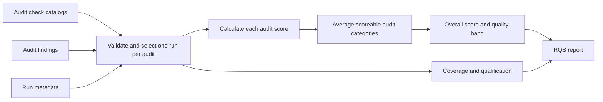

# Repository Quality Score explained

This document explains how Architect Playbook calculates the Repository Quality
Score (RQS) and how the result should be communicated to managers. It describes
the current scoring policy, version `1.0.0`.

## Executive answer

RQS converts completed Architect Playbook audit results into a score from 0 to
100. Each audit is scored independently, normalized to 100, and then the
scoreable audit categories are averaged with equal weight.

The score is always reported with assessment coverage and a qualification:
`official`, `provisional`, or `unavailable`. A score without those two pieces of
context is incomplete.



## What supplies the score

The current policy registers 14 audit categories. Each registered audit has an
equal category weight of `1.0`. When all 14 categories are scoreable, each
contributes approximately 7.14 percent of the overall score.

For each audit, the calculator reads three inputs:

- `checks.json` defines the checks, their identities, and whether a check is
  standard or soft.
- `findings.json` records what the audit found for every check.
- `metadata.json` proves the run, catalog, repository commit, and execution
  options associated with those findings.

The calculator validates these inputs before using them. It accepts only one
atomic run per audit and never combines individual checks from separate runs or
different commits.

## Check points and weights

Each applicable, evaluated check receives a weight and a status point value.

| Check type | Weight |
| --- | ---: |
| Standard check | 1.0 |
| Soft check | 0.5 |

| Status | Point value | Meaning for scoring |
| --- | ---: | --- |
| `present` | 1.0 | Earns the full check weight |
| `partial` | 0.5 | Earns half the check weight |
| `missing` | 0.0 | Earns no points |
| `violation` | 0.0 | Earns no points |

The calculation for one check is:

```text
earned points = check weight × status point value
```

Examples:

- A standard `present` check earns `1.0 × 1.0 = 1.0` point.
- A standard `partial` check earns `1.0 × 0.5 = 0.5` points.
- A soft `partial` check earns `0.5 × 0.5 = 0.25` points.
- A standard `violation` check earns `1.0 × 0.0 = 0` points.

## Applicability and evaluation

Not every check is automatically placed in the score denominator.

| Check state | Score treatment | Coverage treatment |
| --- | --- | --- |
| Applicable and evaluated | Included | Counted as evaluated |
| Applicable but not evaluated | Excluded | Reduces check coverage |
| Not applicable | Excluded | Does not reduce check coverage |

For example, React-specific checks can be explicitly not applicable in a
non-React repository. The React audit must still run and prove that condition;
a missing React audit is not treated as not applicable.

## Audit-category score

Each audit is normalized to a score out of 100:

```text
audit score = sum(earned points for applicable evaluated checks)
              ÷ sum(weights for applicable evaluated checks)
              × 100
```

Normalizing every audit prevents an audit with a large check catalog from
automatically dominating an audit with fewer checks.

## Overall score

The overall score is the weighted average of the scoreable audit categories:

```text
overall score = sum(audit score × audit category weight)
                ÷ sum(included audit category weights)
```

All 14 audit-category weights are currently `1.0`, so this is an equal average
of the audit categories that contain at least one applicable, evaluated check.

Missing audits are not silently scored as zero. They reduce audit coverage and
make the result provisional. This keeps an evidence gap separate from a proved
quality failure.

## Worked example

Assume only three audits have been completed for illustration.

### Architecture audit

| Check | Weight | Status | Earned |
| --- | ---: | --- | ---: |
| Standard check A | 1.0 | `present` | 1.0 |
| Standard check B | 1.0 | `partial` | 0.5 |
| Soft check C | 0.5 | `missing` | 0.0 |

```text
Architecture score = 1.5 ÷ 2.5 × 100 = 60.00
```

Assume the testing audit scores `100.00` and the security audit scores `25.00`.
Because the category weights are equal:

```text
Overall score = (60.00 + 100.00 + 25.00) ÷ 3
              = 61.67
```

The quality band is `Needs attention`. The audit coverage is only `3/14`, so
the result is `provisional`, even if every check inside those three audits was
evaluated. The other 11 audits are not inserted as zeros.

## Quality bands

RQS uses decimal arithmetic and rounds half-up to two decimal places before
assigning a band.

| Rounded score | Quality band |
| --- | --- |
| 90.00–100.00 | Strong |
| 75.00–89.99 | Sound |
| 60.00–74.99 | Needs attention |
| 0.00–59.99 | High risk |

## Coverage is separate from quality

RQS reports several coverage measures:

- **Catalog coverage:** policy audit catalogs loaded out of 14 expected.
- **Audit coverage:** valid current-commit audit runs selected out of 14
  expected.
- **Applicable-check coverage:** applicable checks evaluated divided by all
  known applicable checks in selected runs.
- **Scored audits:** selected audits containing at least one applicable,
  evaluated check.
- **Non-applicable audits:** completed audits that proved their whole domain
  does not apply.

RQS does not multiply the quality score by coverage. Managers should therefore
read these together:

```text
RQS: 82.50/100 — Sound
Status: Provisional
Audit coverage: 6/14
Applicable-check coverage: 98 percent
```

This means the assessed areas are sound, but the repository has not yet
received a complete assessment.

## Result qualification

### Official

An official score requires all policy audits to provide compatible canonical
evidence for the current clean source commit. The runs must be unfiltered, use
no threshold or policy overrides, contain no applicable unevaluated checks, and
contain no degraded evidence. Required graph evidence must also be available.

An official score can still be low. A completely evaluated `violation` lowers
quality but does not make the calculation provisional.

### Provisional

A provisional result has a valid numeric score, but at least one official
condition is missing. Common reasons include missing audits, legacy findings,
filtered runs, a dirty source tree, degraded evidence, unevaluated checks,
catalog problems, or findings from an incompatible commit.

### Unavailable

The result is unavailable when no valid audit category can be scored. In that
case RQS reports no number or quality band and explains which evidence is
missing or invalid.

## Highest-impact deductions

The report ranks up to ten deductions by their exact effect on the overall
score. A deduction accounts for:

- the check's lost points;
- the possible weight inside its audit category; and
- the audit category's share of the included overall score.

The aggregate report points back to the originating audit findings instead of
copying raw evidence.

## How to answer common manager questions

### Why can a repository have a high score with low coverage?

The completed audits may score well while other audits have not run. The result
must be presented as provisional with its coverage; it is not a complete
repository assessment.

### Does a missing audit reduce the score?

No. It reduces coverage and prevents an official result. RQS does not claim
that an unassessed category passed or failed.

### Does a violation prevent an official score?

No. If the violation was evaluated using complete compatible evidence, it
reduces the score but does not invalidate the calculation.

### Are security and accessibility certifications implied?

No. RQS summarizes Architect Playbook audit evidence. It is not a security,
accessibility, legal, or regulatory certification.

### Can two scores be compared?

Only when their score-policy versions match and their included audit catalog
versions are compatible. A policy or baseline change can change the score even
when the repository code did not change.

## Source of truth

- The current numeric rules are defined in
  [`score-policy.json`](../repository-quality-score/score-policy.json).
- The machine-readable result contract is defined in the
  [RQS output reference](../repository-quality-score/references/score-output-contract.md).
- The calculator is the only component authorized to make numeric scoring
  decisions; the AI skill must not estimate or adjust the score in prose.
